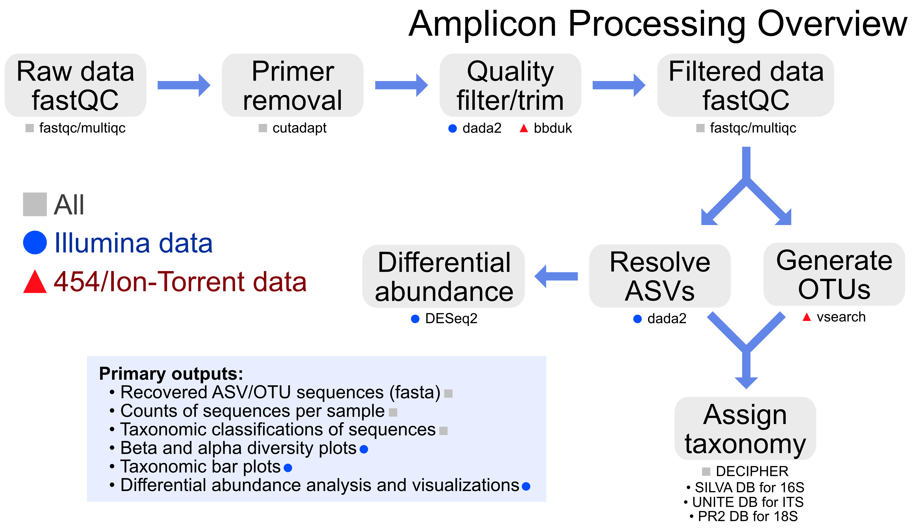

# GeneLab bioinformatics processing pipeline for 454 and IonTorrent amplicon sequencing data

> **The document [`GL-DPPD-7106.md`](Pipeline_GL-DPPD-7106_Versions/GL-DPPD-7106.md) holds an overview and example commands for how GeneLab processes 454 and IonTorrent amplicon sequencing datasets. See the [Repository Links](#repository-links) descriptions below for more information. Processed data output files and processing code is provided for each GLDS dataset in the [GeneLab Data Systems (GLDS) repository](https://genelab-data.ndc.nasa.gov/genelab/projects).**  
> 
> Note: The exact processing commands and Amp454IonTor version used for specific GLDS datasets can be found in the *_processing_info.tar file under "Study Files" for each respective GLDS dataset in the [GLDS repository](https://genelab-data.ndc.nasa.gov/genelab/projects). 

--- 

---
## Repository Links

* [**Pipeline_GL-DPPD-7106_Versions**](Pipeline_GL-DPPD-7106_Versions)

  - Contains the current and previous GeneLab 454 and IonTorrent amplicon sequencing data processing pipeline (Amp454IonTor) versions documentation

* [**Workflow_Documentation**](Workflow_Documentation)

  - Contains instructions for installing and running the GeneLab Amp454IonTor workflow

---

**Developed and maintained by:**  
Michael D. Lee (Mike.Lee@nasa.gov)

