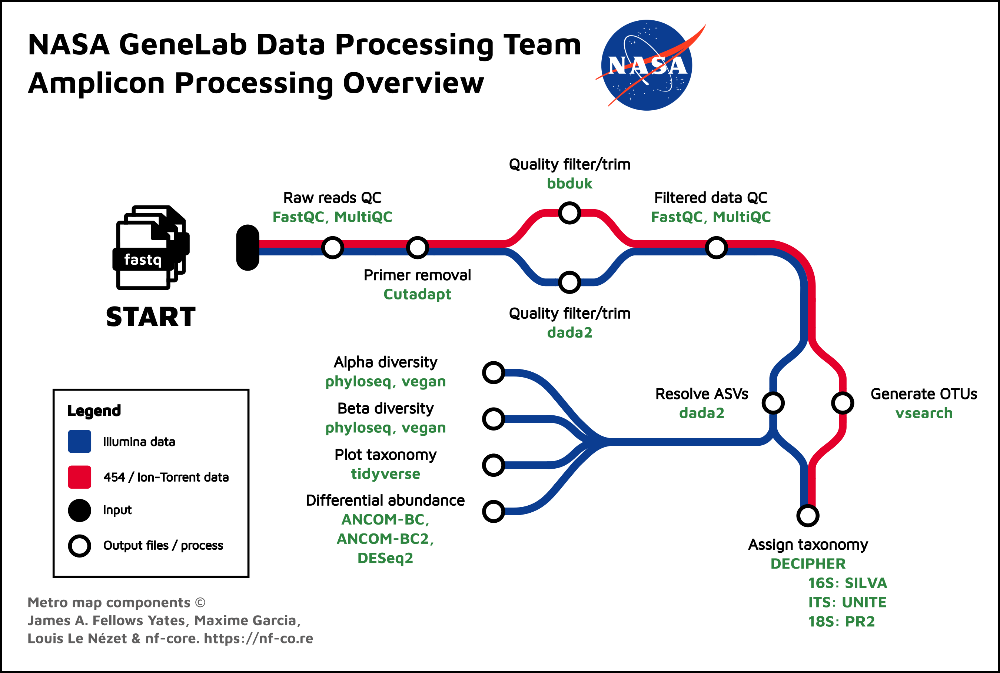

# GeneLab bioinformatics processing pipeline for Illumina amplicon sequencing data

> **The document [`GL-DPPD-7104-C.md`](Pipeline_GL-DPPD-7104_Versions/GL-DPPD-7104-C.md) holds an overview and example commands for how GeneLab processes Illumina amplicon sequencing datasets. See the [Repository Links](#repository-links) descriptions below for more information. Processed data output files and processing code are provided for each GLDS dataset in the [Open Science Data Repository (OSDR)](https://osdr.nasa.gov/bio/repo/).**  
> 
> Note: The exact processing commands and AmpIllumina version used for specific GLDS datasets can be found in the *_processing_info.zip file under "Files" for each respective GLDS dataset in the [Open Science Data Repository (OSDR)](https://osdr.nasa.gov/bio/repo/). 

--- 

---
## Repository Links

* [**Pipeline_GL-DPPD-7104_Versions**](Pipeline_GL-DPPD-7104_Versions)

  - Contains documentation for current and previous versions of the GeneLab Illumina Amplicon Sequencing Data Processing Pipeline (AmpIllumina)

* [**Workflow_Documentation**](Workflow_Documentation)

  - Contains instructions for installing and running the GeneLab AmpIllumina workflow

* [**GLDS_Processing_Scripts**](GLDS_Processing_Scripts)

  - Contains the exact processing commands and AmpIllumina version used for select GLDS datasets that have been released and are available in the [Open Science Data Repository (OSDR)](https://osdr.nasa.gov/bio/repo/)
    > Note: Exact processing commands and AmpIllumina version used for datasets not available in this sub-directory can be found in the *_processing_info.zip file under "Files" for each respective GLDS dataset in the [Open Science Data Repository (OSDR)](https://osdr.nasa.gov/bio/repo/).

---
**Developed by:**  
Michael D. Lee (Mike.Lee@nasa.gov)  
**Maintained by:**  
Olabiyi A. Obayomi (olabiyi.a.obayomi@nasa.gov)
Michael D. Lee (Mike.Lee@nasa.gov)  
Alexis Torres (alexis.torres@nasa.gov)  
Amanda Saravia-Butler (amanda.m.saravia-butler@nasa.gov)  
