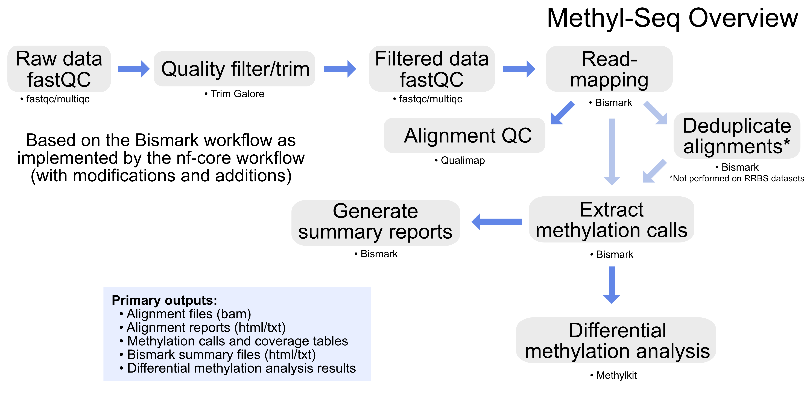

# GeneLab bioinformatics processing pipeline for Methylation Sequencing (Methyl-Seq) data

> **The document [`GL-DPPD-7113.md`](Pipeline_GL-DPPD-7113_Versions/GL-DPPD-7113.md) holds an overview and example commands for how GeneLab processes Methylation Sequencing (Methyl-Seq) data. Processed data output files along with processing code is provided with each GLDS dataset in the [GeneLab Data Systems (GLDS) repository](https://genelab-data.ndc.nasa.gov/genelab/projects).** 

---

--- 

## Repository Links

* [**Pipeline_GL-DPPD-7113_Versions**](Pipeline_GL-DPPD-7113_Versions)

  - Contains the current and previous GeneLab Methyl-Seq consensus processing pipeline (MSCP) versions documentation

* [**Workflow_Documentation**](Workflow_Documentation)

  - Contains instructions for installing and running the GeneLab MSCP workflow
    > Note: The MSCP workflow is currently in development and not yet available 

---
**Developed and maintained by:**  
Michael Lee
