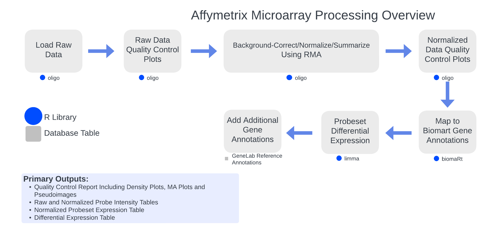

# GeneLab bioinformatics processing pipeline for Affymetrix microarray data

> **The document [`GL-DPPD-7114.md`](Pipeline_GL-DPPD-7114_Versions/GL-DPPD-7114.md) holds an overview and example commands for how GeneLab processes Affymetrix microarray datasets. See the [Repository Links](#repository-links) descriptions below for more information. Processed data output files and processing code is provided for each GLDS dataset along with the processed data in the [Open Science Data Repository (OSDR)](https://osdr.nasa.gov/bio/repo/).**  

--- 

---
## Repository Links

* [**Pipeline_GL-DPPD-7114_Versions**](Pipeline_GL-DPPD-7114_Versions)

  - Contains the current and previous GeneLab Affymetrix microarray data processing pipeline (NF_MAAffy) versions documentation

* [**Workflow_Documentation**](Workflow_Documentation)

  - Contains instructions for installing and running the GeneLab NF_MAAffy workflow
    > Note: The NF_MAAffy workflow is currently in development and not yet available

---
**Developed and maintained by:**  
Jonathan Oribello
