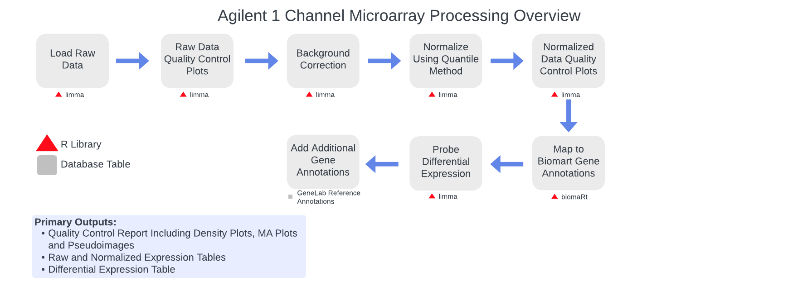

# GeneLab bioinformatics processing pipeline for Agilent 1-channel microarray data

> **The document [`GL-DPPD-7112.md`](Pipeline_GL-DPPD-7112_Versions/GL-DPPD-7112.md) holds an overview and example commands for how GeneLab processes Agilent 1-channel microarray datasets. See the [Repository Links](#repository-links) descriptions below for more information. Processed data output files and processing code is provided for each GLDS dataset along with the processed data in the [GeneLab Data Systems (GLDS) repository](https://genelab-data.ndc.nasa.gov/genelab/projects).**  

--- 

---
## Repository Links

* [**Pipeline_GL-DPPD-7112_Versions**](Pipeline_GL-DPPD-7112_Versions)

  - Contains the current and previous GeneLab Agilent 1-channel microarray data processing pipeline (MAAgilent1ch) versions documentation

* [**Workflow_Documentation**](Workflow_Documentation)

  - Contains instructions for installing and running the GeneLab MAAgilent1ch workflow
    > Note: The MAAgilent1ch workflow is currently in development and not yet available
---
**Developed and maintained by:**  
Jonathan Oribello
