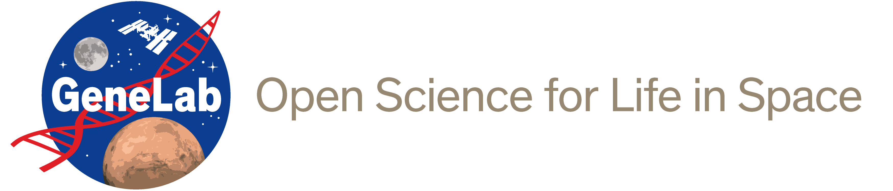

# GeneLab_Data_Processing

## About
The [NASA GeneLab](https://genelab.nasa.gov/) Data Processing team and [Analysis Working Group](https://genelab.nasa.gov/awg/charter) members have created standard pipelines for processing omics data from spaceflight and space-relevant experiments. This repository contains the processing pipelines that have been standardized to date for the assay types indicated below. Each subdirectory in this repository holds current and previous pipeline versions for the respective assay type, including detailed descriptions and processing instructions as well as the exact processing commands used to generate processed data for datasets hosted in the [GeneLab Data Repository](https://genelab-data.ndc.nasa.gov/genelab/projects).

---

## Assay Types
Click on an assay type below for data processing information.  
- [Create GeneLab Reference Annotations](GeneLab_Reference_Annotations)
- [Amplicon Sequencing](Amplicon) 
  - [Illumina](Amplicon/Illumina)  
  - [454 and Ion-Torrent](Amplicon/454-and-IonTorrent)  
- [Metagenomics](Metagenomics)  
  - [Removing human reads](Metagenomics/Remove_human_reads_from_raw_data)  
  - [Illumina](Metagenomics/Illumina)  
- [(bulk) RNAseq](RNAseq)  
- [single cell RNAseq](scRNAseq)  
- [Methylation Sequencing](Methyl-Seq)
- [Microarray](Microarray)
  - [Agilent 1-channel](Microarray/Agilent_1-channel)

---

## Usage
We encourage all investigators working with space-relevant omics data to process their data using the standard pipelines described here when possible. Anyone planning to publish analyses derived from [GeneLab processed data](https://genelab-data.ndc.nasa.gov/genelab/projects) may refer to this repository for data processing methods. If you have omics data from a spaceflight or space-relevant experiment, you can submit your data to GeneLab through our [submission portal](https://genelab-data.ndc.nasa.gov/geode-sso-login/).

---

## Licenses

The software for each pipeline is released under the NASA Open Source Agreement (NOSA) Version 1.3
- [Amplicon License](Licenses/Amplicon_and_Metagenomics_NOSA_License.pdf)
- [Metagenomics License](Licenses/Amplicon_and_Metagenomics_NOSA_License.pdf)

### 3rd Party Software Licenses

Licenses for the 3rd party open source software utilized for each pipeline can be found by clicking the respective pipeline link below:
- [Amplicon License](3rd_Party_Licenses/Amplicon_and_Metagenomics_3rd_Party_Software.md)
- [Metagenomics License](3rd_Party_Licenses/Amplicon_and_Metagenomics_3rd_Party_Software.md)

---

## Notices

Copyright © 2021 United States Government as represented by the Administrator of the National Aeronautics and Space Administration.  All Rights Reserved.

### Disclaimers

No Warranty: THE SUBJECT SOFTWARE IS PROVIDED "AS IS" WITHOUT ANY WARRANTY OF ANY KIND, EITHER EXPRESSED, IMPLIED, OR STATUTORY, INCLUDING, BUT NOT LIMITED TO, ANY WARRANTY THAT THE SUBJECT SOFTWARE WILL CONFORM TO SPECIFICATIONS, ANY IMPLIED WARRANTIES OF MERCHANTABILITY, FITNESS FOR A PARTICULAR PURPOSE, OR FREEDOM FROM INFRINGEMENT, ANY WARRANTY THAT THE SUBJECT SOFTWARE WILL BE ERROR FREE, OR ANY WARRANTY THAT DOCUMENTATION, IF PROVIDED, WILL CONFORM TO THE SUBJECT SOFTWARE. THIS AGREEMENT DOES NOT, IN ANY MANNER, CONSTITUTE AN ENDORSEMENT BY GOVERNMENT AGENCY OR ANY PRIOR RECIPIENT OF ANY RESULTS, RESULTING DESIGNS, HARDWARE, SOFTWARE PRODUCTS OR ANY OTHER APPLICATIONS RESULTING FROM USE OF THE SUBJECT SOFTWARE.  FURTHER, GOVERNMENT AGENCY DISCLAIMS ALL WARRANTIES AND LIABILITIES REGARDING THIRD-PARTY SOFTWARE, IF PRESENT IN THE ORIGINAL SOFTWARE, AND DISTRIBUTES IT "AS IS."

Waiver and Indemnity:  RECIPIENT AGREES TO WAIVE ANY AND ALL CLAIMS AGAINST THE UNITED STATES GOVERNMENT, ITS CONTRACTORS AND SUBCONTRACTORS, AS WELL AS ANY PRIOR RECIPIENT.  IF RECIPIENT'S USE OF THE SUBJECT SOFTWARE RESULTS IN ANY LIABILITIES, DEMANDS, DAMAGES, EXPENSES OR LOSSES ARISING FROM SUCH USE, INCLUDING ANY DAMAGES FROM PRODUCTS BASED ON, OR RESULTING FROM, RECIPIENT'S USE OF THE SUBJECT SOFTWARE, RECIPIENT SHALL INDEMNIFY AND HOLD HARMLESS THE UNITED STATES GOVERNMENT, ITS CONTRACTORS AND SUBCONTRACTORS, AS WELL AS ANY PRIOR RECIPIENT, TO THE EXTENT PERMITTED BY LAW.  RECIPIENT'S SOLE REMEDY FOR ANY SUCH MATTER SHALL BE THE IMMEDIATE, UNILATERAL TERMINATION OF THIS AGREEMENT.

---

### Contact
For any questions, comments, and/or issues please [contact GeneLab](https://genelab.nasa.gov/help/contact).
