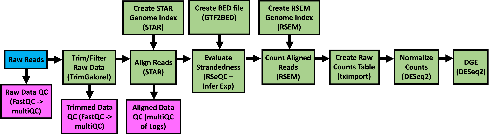

# GeneLab bioinformatics processing pipeline for Illumina RNA-sequencing data

> **The document [`GL-DPPD-7101-F.md`](Pipeline_GL-DPPD-7101_Versions/GL-DPPD-7101-F.md) holds an overview and example commands for how GeneLab processes RNAseq datasets. See the [Repository Links](#repository-links) descriptions below for more information. Processed data output files and a GeneLab data processing summary is provided for each GLDS dataset in the [GeneLab Data Systems (GLDS) repository](https://genelab-data.ndc.nasa.gov/genelab/projects).**  

---

---
## Repository Links

* [**Pipeline_GL-DPPD-7101_Versions**](Pipeline_GL-DPPD-7101_Versions)

  - Contains the current and previous GeneLab RNAseq consensus processing pipeline (RCP) versions documentation

* [**RNAseq_Tool_Install**](RNAseq_Tool_Install)

  - Contains instructions and associated yaml files to install the conda environments containing tools used to process RNAseq datasets using the GeneLab RCP, versions A-E

* [**GeneLab_Reference_and_Annotation_Files**](GeneLab_Reference_and_Annotation_Files)

  - Contains links to the fasta and gtf annotation files used to process RNAseq datasets using the GeneLab RCP, versions A-E
    > Note: Reference annotation files used from RCP version F and onward are documented in [GeneLab_Reference_Annotations](../GeneLab_Reference_Annotations)

* [**Workflow_Documentation**](Workflow_Documentation)

  - Contains instructions for installing and running the GeneLab RCP workflow
    > Note: The RCP workflow was implemented beginning with RCP version F 

* [**GLDS_Processing_Scripts**](GLDS_Processing_Scripts)

  - Contains the exact processing commands and RCP version used for specific GLDS datasets that have been released and are available in the [GeneLab Data Systems (GLDS) repository](https://genelab-data.ndc.nasa.gov/genelab/projects)

 

---

## Licenses

The software for the RNAseq pipeline and workflow is released under the [NASA Open Source Agreement (NOSA) Version 1.3](../Licenses/RNA_Sequencing_NOSA_License.pdf).

### 3rd Party Software Licenses

Licenses for the 3rd party open source software utilized in the RNAseq pipeline and workflow can be found in the [3rd_Party_Licenses sub-directory](../3rd_Party_Licenses/RNAseq_3rd_Party_Software.md) on the GeneLab_Data_Processing GitHub repository landing page. 

 

---

## Notices

Copyright © 2023 United States Government as represented by the Administrator of the National Aeronautics and Space Administration.  All Rights Reserved. 

### Disclaimers

No Warranty: THE SUBJECT SOFTWARE IS PROVIDED "AS IS" WITHOUT ANY WARRANTY OF ANY KIND, EITHER EXPRESSED, IMPLIED, OR STATUTORY, INCLUDING, BUT NOT LIMITED TO, ANY WARRANTY THAT THE SUBJECT SOFTWARE WILL CONFORM TO SPECIFICATIONS, ANY IMPLIED WARRANTIES OF MERCHANTABILITY, FITNESS FOR A PARTICULAR PURPOSE, OR FREEDOM FROM INFRINGEMENT, ANY WARRANTY THAT THE SUBJECT SOFTWARE WILL BE ERROR FREE, OR ANY WARRANTY THAT DOCUMENTATION, IF PROVIDED, WILL CONFORM TO THE SUBJECT SOFTWARE. THIS AGREEMENT DOES NOT, IN ANY MANNER, CONSTITUTE AN ENDORSEMENT BY GOVERNMENT AGENCY OR ANY PRIOR RECIPIENT OF ANY RESULTS, RESULTING DESIGNS, HARDWARE, SOFTWARE PRODUCTS OR ANY OTHER APPLICATIONS RESULTING FROM USE OF THE SUBJECT SOFTWARE.  FURTHER, GOVERNMENT AGENCY DISCLAIMS ALL WARRANTIES AND LIABILITIES REGARDING THIRD-PARTY SOFTWARE, IF PRESENT IN THE ORIGINAL SOFTWARE, AND DISTRIBUTES IT "AS IS."

Waiver and Indemnity:  RECIPIENT AGREES TO WAIVE ANY AND ALL CLAIMS AGAINST THE UNITED STATES GOVERNMENT, ITS CONTRACTORS AND SUBCONTRACTORS, AS WELL AS ANY PRIOR RECIPIENT.  IF RECIPIENT'S USE OF THE SUBJECT SOFTWARE RESULTS IN ANY LIABILITIES, DEMANDS, DAMAGES, EXPENSES OR LOSSES ARISING FROM SUCH USE, INCLUDING ANY DAMAGES FROM PRODUCTS BASED ON, OR RESULTING FROM, RECIPIENT'S USE OF THE SUBJECT SOFTWARE, RECIPIENT SHALL INDEMNIFY AND HOLD HARMLESS THE UNITED STATES GOVERNMENT, ITS CONTRACTORS AND SUBCONTRACTORS, AS WELL AS ANY PRIOR RECIPIENT, TO THE EXTENT PERMITTED BY LAW.  RECIPIENT'S SOLE REMEDY FOR ANY SUCH MATTER SHALL BE THE IMMEDIATE, UNILATERAL TERMINATION OF THIS AGREEMENT. 

The “GeneLab RNA Sequencing Processing Pipeline and Workflow” software also makes use of the following 3rd party Open Source software, released under the licenses indicated above.  A complete listing of 3rd Party software notices and licenses made use of in “GeneLab RNA Sequencing Processing Pipeline and Workflow” can be found in the [RNAseq_3rd_Party_Software.md](../3rd_Party_Licenses/RNAseq_3rd_Party_Software.md) file as indicated above. 

 

---
**Developed and maintained by:**  
Amanda Saravia-Butler  
Jonathan Oribello
