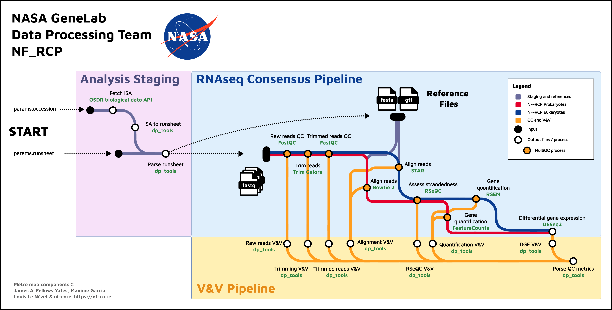

# NF_RCP Workflow Information and Usage Instructions <!-- omit in toc -->

## General Workflow Info <!-- omit in toc -->

### Implementation Tools <!-- omit in toc -->

The current GeneLab RNAseq consensus processing pipeline (RCP) for eukaryotic organisms, [GL-DPPD-7101-G](../../Pipeline_GL-DPPD-7101_Versions/GL-DPPD-7101-G.md) and the GeneLab RNAseq consensus pipeline [GL-DPPD-7115](../../Pipeline_GL-DPPD-7115_Versions/GL-DPPD-7115.md), are implemented as a single [Nextflow](https://nextflow.io/) DSL2 workflow that utilizes [Singularity](https://docs.sylabs.io/guides/3.10/user-guide/introduction.html) to run all tools in containers. This workflow (NF_RCP) is run using the command line interface (CLI) of any unix-based system. While knowledge of creating workflows in Nextflow is not required to run the workflow as is, [the Nextflow documentation](https://nextflow.io/docs/latest/index.html) is a useful resource for users who want to modify and/or extend this workflow.   

### Workflow & Subworkflows <!-- omit in toc -->

---

- **Click image to expand**

<p align="center">
<a href="../../images/NF_RCP_metro_map_sections.svg"></a>
</p>

---
The NF_RCP workflow is composed of three subworkflows as shown in the image above.
Below is a description of each subworkflow and the additional output files generated that are not already indicated in the [GL-DPPD-7101-G pipeline 
document](../../Pipeline_GL-DPPD-7101_Versions/GL-DPPD-7101-G.md):

1. **Analysis Staging Subworkflow**

   - Description:
     - This subworkflow extracts the metadata parameters (e.g. organism, library layout) needed for processing from the OSD/GLDS ISA archive and retrieves the raw reads files hosted on the [Open Science Data Repository (OSDR)](https://osdr.nasa.gov/bio/repo/).
       > *OSD/GLDS ISA archive*: ISA directory containing Investigation, Study, and Assay (ISA) metadata files for a respective GLDS dataset - the *ISA.zip file is located in the [OSDR](https://osdr.nasa.gov/bio/repo/) under 'Files' -> 'Study Metadata Files' for any GeneLab Data Set (GLDS) in the OSDR.

2. **RNAseq Consensus Pipeline Subworkflow**

   - Description:
     - This subworkflow uses the staged raw data and metadata parameters from the Analysis Staging Subworkflow to generate processed data using either:
       - [Version G of the GeneLab RCP](../../Pipeline_GL-DPPD-7101_Versions/GL-DPPD-7101-G.md) when the `--mode` parameter is omitted (default)
       - [The GeneLab Prokaryotic RCP](../../Pipeline_GL-DPPD-7115_Versions/GL-DPPD-7115.md) when using `--mode microbes`
       
       The selection impacts the choice of aligner and read counter tools used in the pipeline.

3. **V&V Pipeline Subworkflow**

   - Description:
     - This subworkflow performs validation and verification (V&V) on the raw and processed data files in real-time.  It performs a series of checks on the output files generated and flags the results, using the flag codes indicated in the table below, which are outputted as a series of log files. 
     
       **V&V Flags**:

       |Flag Codes|Flag Name|Interpretation|
       |:---------|:--------|:-------------|
       | 20    | GREEN   | Indicates the check passed all validation conditions |
       | 30    | YELLOW  | Indicates the check was flagged for minor issues (e.g. slight outliers) |
       | 50    | RED     | Indicates the check was flagged for moderate issues (e.g. major outliers) |
       | 80    | HALT    | Indicates the check was flagged for severe issues that trigger a processing halt (e.g. missing data) |

<br>

---
## Utilizing the Workflow

1. [Install Nextflow and Singularity](#1-install-nextflow-and-singularity)  
   1a. [Install Nextflow](#1a-install-nextflow)  
   1b. [Install Singularity](#1b-install-singularity)
2. [Download the Workflow Files](#2-download-the-workflow-files)  
3. [Fetch Singularity Images](#3-fetch-singularity-images)  
4. [Run the Workflow](#4-run-the-workflow)  
   4a. [Approach 1: Run the workflow on a GeneLab RNAseq dataset with automatic retrieval of Ensembl reference fasta and gtf files](#4a-approach-1-run-the-workflow-on-a-genelab-rnaseq-dataset-with-automatic-retrieval-of-ensembl-reference-fasta-and-gtf-files)  
   4b. [Approach 2: Run the workflow on a GeneLab RNAseq dataset using local Ensembl reference fasta and gtf files](#4b-approach-2-run-the-workflow-on-a-genelab-rnaseq-dataset-using-local-reference-fasta-and-gtf-files)  
   4c. [Approach 3: Run the workflow on a non-GLDS dataset using a user-created runsheet](#4c-approach-3-run-the-workflow-on-a-non-glds-dataset-using-a-user-created-runsheet)  
   4d. [Approach 4: Run the workflow on a GeneLab prokaryotic RNAseq dataset](#4d-approach-4-run-the-workflow-on-a-genelab-prokaryotic-rnaseq-dataset)  
5. [Additional Output Files](#5-additional-output-files)  

<br>

---

### 1. Install Nextflow and Singularity 

#### 1a. Install Nextflow

Nextflow can be installed either through [Anaconda](https://anaconda.org/bioconda/nextflow) or as documented on the [Nextflow documentation page](https://www.nextflow.io/docs/latest/getstarted.html).

> Note: If you want to install Anaconda, we recommend installing a Miniconda, Python3 version appropriate for your system, as instructed by [Happy Belly Bioinformatics](https://astrobiomike.github.io/unix/conda-intro#getting-and-installing-conda).  
> 
> Once conda is installed on your system, you can install the latest version of Nextflow by running the following commands:
> 
> ```bash
> conda install -c bioconda nextflow
> nextflow self-update
> ```

<br>

#### 1b. Install Singularity

Singularity is a container platform that allows usage of containerized software. This enables the GeneLab RCP workflow to retrieve and use all software required for processing without the need to install the software directly on the user's system.

We recommend installing Singularity on a system wide level as per the associated [documentation](https://docs.sylabs.io/guides/3.10/admin-guide/admin_quickstart.html).

> Note: Singularity is also available through [Anaconda](https://anaconda.org/conda-forge/singularity).

<br>

---

### 2. Download the Workflow Files

All files required for utilizing the NF_RCP GeneLab workflow for processing RNAseq data are in the [workflow_code](workflow_code) directory. To get a 
copy of latest NF_RCP version on to your system, the code can be downloaded as a zip file from the release page then unzipped after downloading by running the following commands: 

```bash
wget https://github.com/nasa/GeneLab_Data_Processing/releases/download/NF_RCP_2.0.0/NF_RCP_2.0.0.zip

unzip NF_RCP_2.0.0.zip
```

<br>

---

### 3. Fetch Singularity Images

Although Nextflow can fetch Singularity images from a url, doing so may cause issues as detailed [here](https://github.com/nextflow-io/nextflow/issues/1210).

To avoid this issue, run the following command to fetch the Singularity images prior to running the NF_RCP workflow:
> Note: This command should be run in the location containing the `NF_RCP_2.0.0` directory that was downloaded in [step 2](#2-download-the-workflow-files) above. Depending on your network speed, fetching the images will take ~20 minutes.  

```bash
bash NF_RCP_2.0.0/bin/prepull_singularity.sh NF_RCP_2.0.0/config/software/by_docker_image.config
```


Once complete, a `singularity` folder containing the Singularity images will be created. Run the following command to export this folder as a Nextflow configuration environment variable to ensure Nextflow can locate the fetched images:

```bash
export NXF_SINGULARITY_CACHEDIR=$(pwd)/singularity
```

<br>

---

### 4. Run the Workflow

While in the location containing the `NF_RCP_2.0.0` directory that was downloaded in [step 2](#2-download-the-workflow-files), you are now able to run the workflow. Below are four examples of how to run the NF_RCP workflow:
> Note: Nextflow commands use both single hyphen arguments (e.g. -help) that denote general nextflow arguments and double hyphen arguments (e.g. --ensemblVersion) that denote workflow specific parameters.  Take care to use the proper number of hyphens for each argument.

<br>

#### 4a. Approach 1: Run the workflow on a GeneLab RNAseq dataset with automatic retrieval of Ensembl reference fasta and gtf files

```bash
nextflow run NF_RCP_2.0.0/main.nf \ 
   -profile singularity \
   --accession OSD-194 
```

<br>

#### 4b. Approach 2: Run the workflow on a GeneLab RNAseq dataset using local reference fasta and gtf files

> Note: The `--reference_source` and `--reference_version` parameters should match the reference source and version number of the local reference fasta and gtf files used

```bash
nextflow run NF_RCP_2.0.0/main.nf \ 
   -profile singularity \
   --accession OSD-194 \
   --reference_version 107 \
   --reference_source ensembl \ 
   --reference_fasta </path/to/fasta> \ 
   --reference_gtf </path/to/gtf> 
```

<br>

#### 4c. Approach 3: Run the workflow on a non-OSD dataset using a user-created runsheet

> Note: Specifications for creating a runsheet manually are described [here](examples/runsheet/README.md).

```bash
nextflow run NF_RCP_2.0.0/main.nf \ 
   -profile singularity \
   --runsheet_path </path/to/runsheet> 
```

<br>

#### 4d. Approach 4: Run the workflow on a GeneLab prokaryotic RNAseq dataset

```bash
nextflow run NF_RCP_2.0.0/main.nf \ 
   -profile singularity \
   --mode microbes \
   --accession OSD-185
```

<br>

**Required Parameters For All Approaches:**

* `NF_RCP_2.0.0/main.nf` - Instructs Nextflow to run the NF_RCP workflow 

* `-profile` - Specifies the configuration profile(s) to load, `singularity` instructs Nextflow to setup and use singularity for all software called in the workflow
  > Note: The output directory will be named `GLDS-#` when using a OSDR or GLDS accession as input, or `results` when running the workflow with only a runsheet as input.


<br>

**Additional Required Parameters For [Approach 2](#4b-approach-2-run-the-workflow-on-a-genelab-rnaseq-dataset-using-local-ensembl-reference-fasta-and-gtf-files):**

* `--reference_version` - specifies the Ensembl version to use for the reference genome (Ensembl release `107` is used in this example); only needed when using Ensembl as the reference source

* `--reference_source` - specifies the source of the reference files used (the source indicated in the Approach 2 example is `ensembl`) 

* `--reference_fasta` - specifices the path to a local fasta file 

* `--reference_gtf` - specifices the path to a local gtf file  

  > Note: If the local reference files specified are different than the reference files used to create the [GeneLab annotations table](https://github.com/nasa/GeneLab_Data_Processing/blob/master/GeneLab_Reference_Annotations/Pipeline_GL-DPPD-7110_Versions/GL-DPPD-7110/GL-DPPD-7110_annotations.csv), additional gene annotations associated with any gene IDs from the specified files that are not shared in the GeneLab annotations will not be added to the DGE output table(s). 

<br>

**Optional Parameters:**

* `--skip_vv` - skip the automated V&V processes (Default: the automated V&V processes are active) 

* `--outdir` - specifies the base directory where the output directory will be created (Default: output directory is created in the launch directory)  

* `--force_single_end` - forces the analysis to use single end processing; for paired end datasets, this means only R1 is used; for single end datasets, this should have no effect  

* `--reference_store_path` - specifies the directory to store the Ensembl fasta and gtf files (Default: within the directory structure created by default in the launch directory)  

* `--derived_store_path` - specifies the directory to store the tool-specific indices created during processing (Default: within the directory structure created by default in the launch directory) 

* `--runsheet_path` - specifies the path to a local runsheet (Default: a runsheet is automatically generated using the metadata on the GeneLab Repository for the OSD dataset being processed)
  > This is required when prcessing a non-OSD dataset as indicated in [Approach 3 above](#4c-approach-3-run-the-workflow-on-a-non-glds-dataset-using-a-user-created-runsheet)

* `--mode` - specifies which pipeline to use: set to `default` to run GL-DPPD-7101-G pipeline or set to `microbes` for the GL-DPPD-7115 prokaryotic pipeline (Default value: `default`)
  > This allows the workflow to process either eukaryotic (default) or prokaryotic RNAseq data using the appropriate pipeline

<br>

**Additional Optional Parameters:**

All parameters listed above and additional optional arguments for the RCP workflow, including debug related options that may not be immediately useful for most users, can be viewed by running the following command:

```bash
nextflow run NF_RCP_2.0.0/main.nf --help
```

See `nextflow run -h` and [Nextflow's CLI run command documentation](https://nextflow.io/docs/latest/cli.html#run) for more options and details common to all nextflow workflows.

<br>

---

### 5. Additional Output Files

The outputs from the Analysis Staging and V&V Pipeline Subworkflows are described below:
> Note: The outputs from the RNAseq Consensus Pipeline Subworkflow are documented in the [GL-DPPD-7101-G](../../Pipeline_GL-DPPD-7101_Versions/GL-DPPD-7101-G.md) processing protocol.

**Analysis Staging Subworkflow**

   - Output:
     - Metadata/\*_bulkRNASeq_v1_runsheet.csv (table containing metadata required for processing, including the raw reads files location)
     - Metadata/\*-ISA.zip (the ISA archive of the OSD datasets to be processed, downloaded from the OSDR)
   
   
**V&V Pipeline Subworkflow**

   - Output:
     - VV_Logs/VV_log_final_GLbulkRNAseq.csv (table containing V&V flags for all checks performed)
     - VV_Logs/VV_log_final_only_issues_GLbulkRNAseq.csv (table containing V&V flags ONLY for checks that produced a flag code >= 30)
     - VV_Logs/VV_log_VV_RAW_READS_GLbulkRNAseq.csv (table containing V&V flags ONLY for raw reads checks)
     - VV_Logs/VV_log_VV_TRIMMED_READS_GLbulkRNAseq.csv (table containing V&V flags for trimmed reads checks ONLY)
     - VV_Logs/VV_log_VV_ALIGNMENT_GLbulkRNAseq.csv (table containing V&V flags for alignment file checks ONLY)
     - VV_Logs/VV_log_VV_RSEQC_GLbulkRNAseq.csv (table containing V&V flags for RSeQC file checks ONLY)
     - VV_Logs/VV_log_VV_COUNTS_GLbulkRNAseq.csv (table containing V&V flags for gene quantification file checks ONLY) 
     - VV_Logs/VV_log_VV_DESEQ2_ANALYSIS_GLbulkRNAseq.csv (table containing V&V flags for DESeq2 Analysis output checks ONLY)

**Processing Information Archive**

   - Output:
     - GeneLab/processing_info_GLbulkRNAseq.zip (Archive containing workflow execution metadata)
       - processing_info/samples.txt (single column list of all sample names in the dataset)
       - processing_info/nextflow_log_GLbulkRNAseq.txt (Nextflow execution logs captured via `nextflow log`)
       - processing_info/nextflow_run_command_GLbulkRNAseq.txt (Exact command line used to initiate the workflow)

<br>

Standard Nextflow resource usage logs are also produced as follows:
> Further details about these logs can also found within [this Nextflow documentation page](https://www.nextflow.io/docs/latest/tracing.html#execution-report).

**Nextflow Resource Usage Logs**

   - Output:
     - nextflow_info/execution_report_{timestamp}.html (an html report that includes metrics about the workflow execution including computational resources and exact workflow process commands)
     - nextflow_info/execution_timeline_{timestamp}.html (an html timeline for all processes executed in the workflow)
     - nextflow_info/execution_trace_{timestamp}.txt (an execution tracing file that contains information about each process executed in the workflow, including: submission time, start time, completion time, cpu and memory used, machine-readable output)
     - nextflow_info/pipeline_dag_{timestamp}.html (a visualization of the workflow process DAG)

<br>
