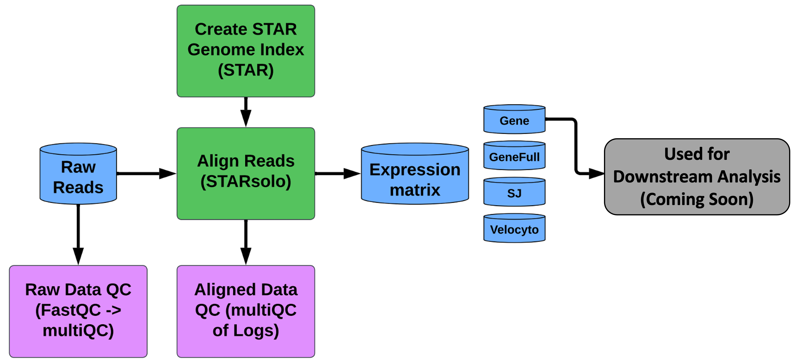

# GeneLab bioinformatics processing pipeline for 10X Chromium 3' single cell RNA-sequencing data

> **The document [`GL-DPPD-7111.md`](Pipeline_GL-DPPD-7111_Versions/GL-DPPD-7111.md) holds an overview and example commands for how GeneLab processes single cell RNA-sequencing (scRNAseq) datasets. See the [Repository Links](#repository-links) descriptions below for more information. Processed data output files and a GeneLab data processing summary is provided for each GLDS dataset in the [GeneLab Data Systems (GLDS) repository](https://genelab-data.ndc.nasa.gov/genelab/projects).**

---

---
## Repository Links

* [**Pipeline_GL-DPPD-7111_Versions**](Pipeline_GL-DPPD-7111_Versions)

  - Contains the current and previous GeneLab single cell RNAseq consensus processing pipeline (scRCP) versions documentation

* [**scRNAseq_Tool_Install**](scRNAseq_Tool_Install)

  - Contains instructions and associated yaml files to install the conda environments containing tools used to process single cell RNAseq datasets using the GeneLab scRCP  

* [**GLDS_Processing_Scripts**](GLDS_Processing_Scripts)

  - Contains the exact processing commands and scRCP version used for specific GLDS datasets that have been released and are available in the [GeneLab Data Systems (GLDS) repository](https://genelab-data.ndc.nasa.gov/genelab/projects)

---
**Developed and maintained by:**  

Lauren Sanders

